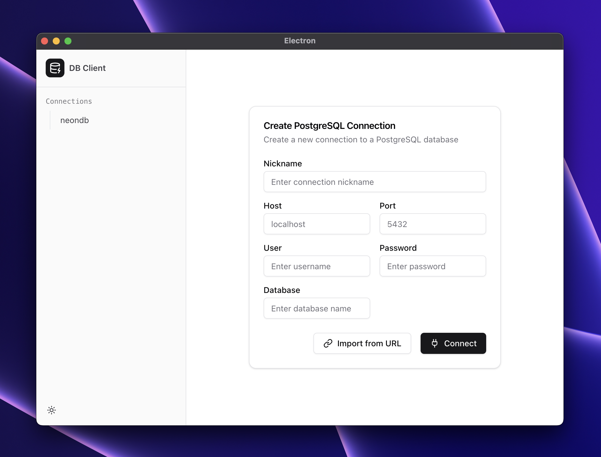
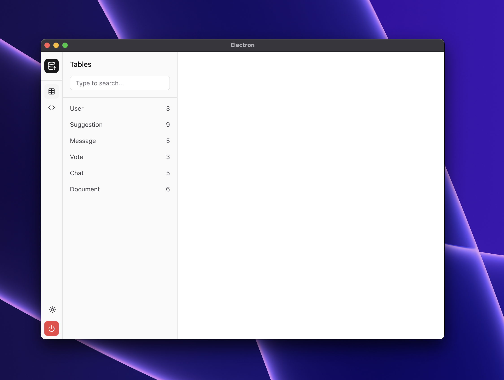

# FastBase - WIP 

  

A modern, high-performance PostgreSQL client for Mac users who demand speed, efficiency, and a contemporary user experience. FastBase is designed to be a powerful alternative to existing database management tools, with a specific focus on PostgreSQL optimization.

## ✨ Key Features

- 🚀 **Blazing Fast Performance** - Optimized for smooth handling of large PostgreSQL datasets
- 🎨 **Modern UI/UX** - Clean, intuitive interface designed specifically for PostgreSQL workflows
- 🔍 **Advanced PostgreSQL Support** - Full support for arrays, JSON, materialized views, and extensions
- 🤖 **AI-Powered Features (coming soon)** - Intelligent query suggestions and PostgreSQL-aware autocompletion
- 📑 **Tab-Based Interface (coming soon)** - Effortlessly manage multiple queries and connections
- 🔒 **Secure Connections** - Built-in support for SSL encryption and SSH tunneling

## 💡 Usage

1. Launch FastBase
2. Connect to your PostgreSQL database using the connection manager
3. Start querying and managing your database with our intuitive interface

## 🔥 Why FastBase?

- **PostgreSQL-First:** Built specifically for PostgreSQL, ensuring optimal performance and feature support
- **Performance Focused:** No more UI lag when handling large datasets
- **Modern Interface:** Clean, intuitive design that makes database management a pleasure
- **AI-Enhanced:** Smart features that help you write better queries and manage your database more efficiently
- **Free & Open Source:** Community-driven development focusing on what PostgreSQL users actually need
